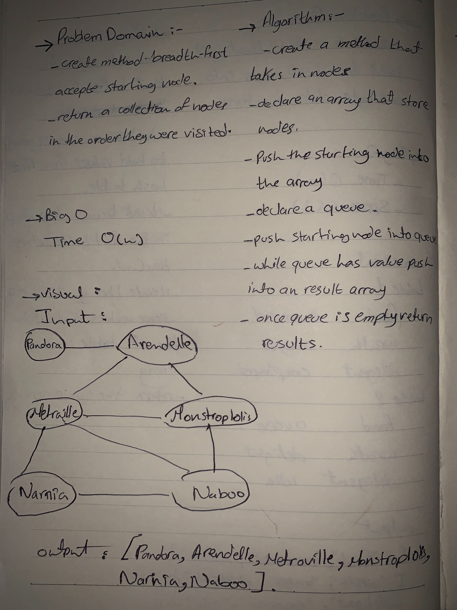

# Breadth-first Graphs
  - Implement a breadth-first traversal on a graph.

# Challenge
  - EExtend your graph object with a breadth-first traversal method that accepts a starting node.
  - Without utilizing any of the built-in methods available to your language.
  - return a collection of nodes in the order they were visited.
  - Display the collection.

# Links
  - [Submission PR](https://github.com/amal-401-advanced-javascript/data-structures-and-algorithms/pull/41)

# Approach & Efficiency
# Big O
  - Time -> O(n)

## API
 - 