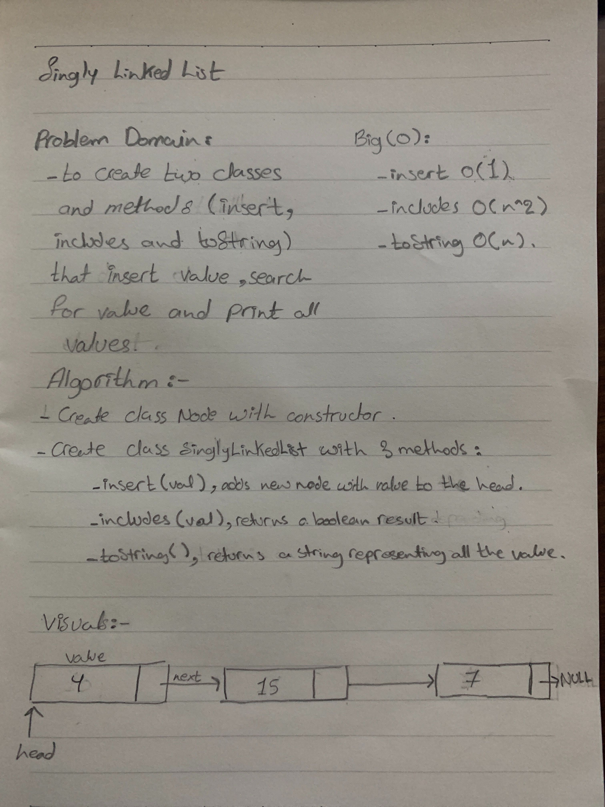
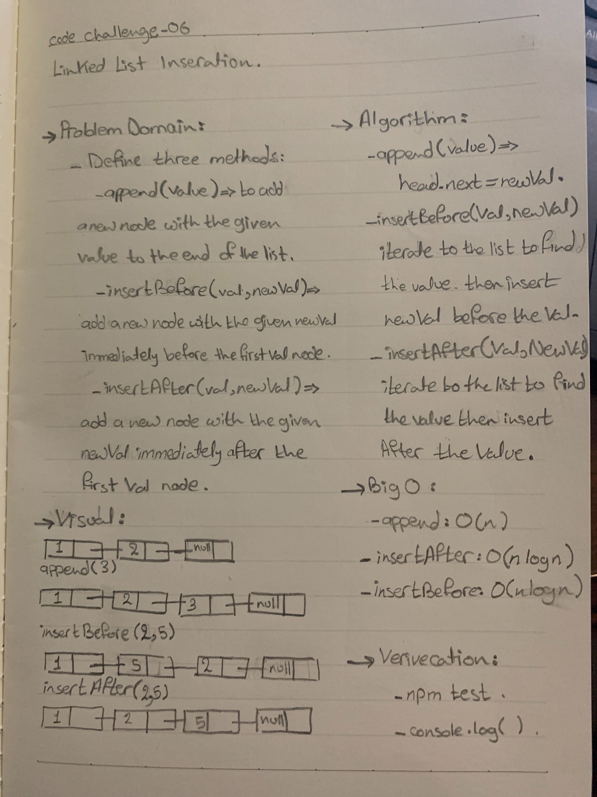
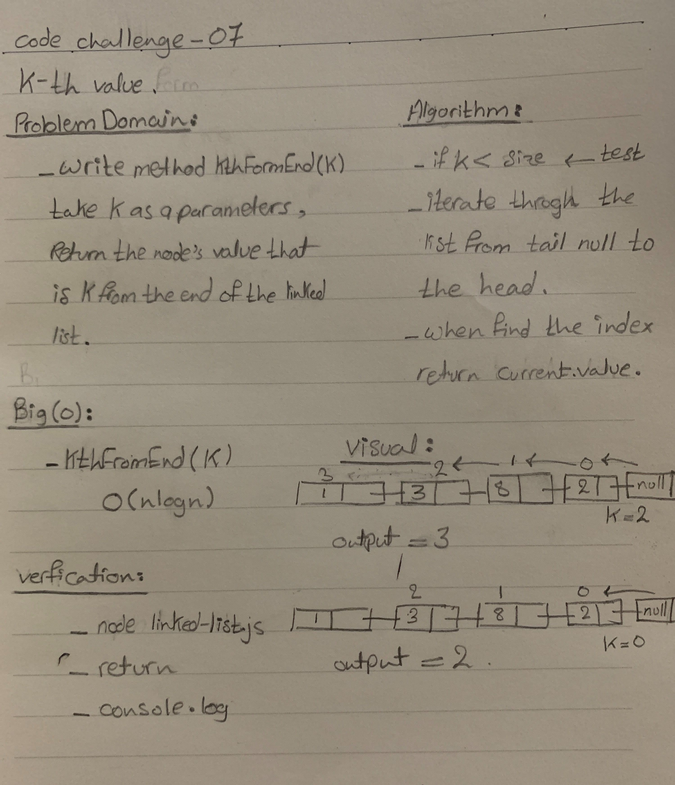

# Singly Linked List
  -  way to store a collection of elements. Like an array these can be character or integers. Each element in a linked list is stored in the form of a node.

## Challenge
- create two classes named node and singlylinkedlist which has a constructor and 3 methodes:
  - 1. insert(value), adds a new node with that value to the head of the list with an O(1) Time performance.
  - 2. includes(value), returns a boolean result depending on whether that value exists as a Node’s value somewhere within the list.
  - 3. toString(),returns a string representing all the values in the Linked List.
  - 4. append(value) which adds a new node with the given value to the end of the list.
  - 5. insertBefore(value, newVal) which add a new node with the given newValue immediately before the first value node.
  - 5. insertAfter(value, newVal) which add a new node with the given newValue immediately after the first value node.

## Approach & Efficiency
- insert O(1)
- includes O(n)
- toString O(n)
- append O(n)
- insertAfter O(nlogn)
- insertBefore O(nlogn)
- kthFromEnd O(nlogn)

## API
 - 
 - 
 - 

