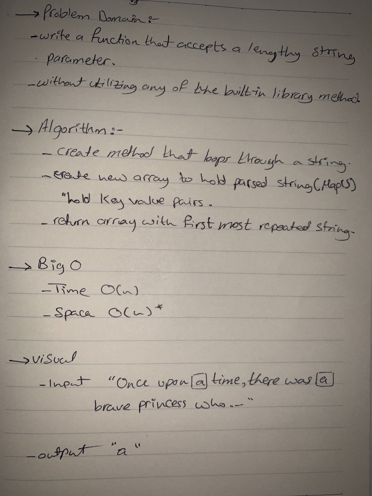

# Repeated Word

# Challenge:
  - Write a function that accepts a lengthy string parameter.
  - Without utilizing any of the built-in library methods available to your language, return the first word to occur more than once in that provided string.

# Approach and Effiency
  - My approach was to loop through the array (which contains the string split) and for any array item that was missing a key to set its key to true. Then while an existing word appears multiple times, it is pushed into an results array, then returns the first most repeated word.

# Effiency
  - Time: O(n) => (loops)
  - Space: 0(n)* => (array coud be resized)

# Links and Resources
  - [submissionPR](https://github.com/amal-401-advanced-javascript/data-structures-and-algorithms/pull/36)

# Solution
  - 
