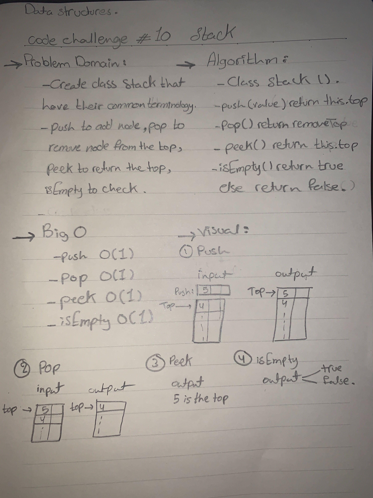

# Stacks and Queues
  - Stacks: is a data structure that consists of    `Nodes`.FILO(First In Last Out).
  - Queues: is a liner data structure or FIFO(First In First Out).

## Challenge
   - Create class Node:
    - Stacks
      - Create class Stack that have their common terminology: 
        - 1. push(value): adds a new node with that value to the top.
        - 2. pop(): removes the node from the top of the stack.
        - 3. peek(): returns the value of the node located on top of the stack.
        - 4. isEmpty(): returns a boolean indicating whether or not the stack is empty.
    - Queues 
      - Create class Queue that have their common terminology: 
        - 1. enqueue(value): adds a new node with that value to the back of the queue.
        - 2. dequeue(): removes the node from the front of the queue.
        - 3. peek(): returns the value of the node located in the front of the queue.
        - 4. isEmpty(): returns a boolean indicating whether or not the queue is empty.

## Approach & Efficiency
   - Stacks 
     - 1. push(value) --> O(1) 
     - 2. pop() ---> O(1)
     - 3. peek() --> O(1)
     - 4. IsEmpty() --> O(1)
   - Queues
     - 1. enqueue(value) --> O(1)
     - 2. dequeue() --> O(1)
     - 3. peek() --> O(1)
     - 4. isEmpty() --> O(1)

## API
  - 
  - 