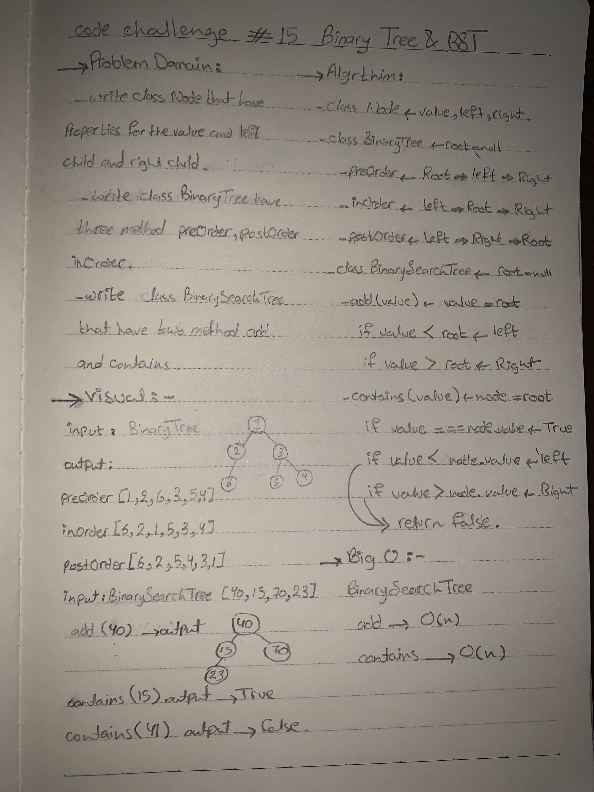

# Tree
  - Data structure can be defined recursively as a collection of nodes (starting at a root node), where each node is a data structure consisting of a value, together with a list of references to nodes (the "children"), with the constraints that no reference is duplicated, and none points to the root.

## Challenge
   - Create class BinarySearch:
    - preOrder
      - Root -> Left -> Right 
    - inOrder
      - Left -> Root -> Right 
    - postOrder
      - Left -> Right -> Root

  - Create class BinarySearchTree
    - add(value)
      - adds a new node with that value in the correct location in the binary search tree.
    - contains(value)
      - returns a boolean indicating whether or not the value is in the tree at least once.

## Approach & Efficiency
   - add(value)
     - O(n)
   - contains(value)
     - O(n)

## API
  - 