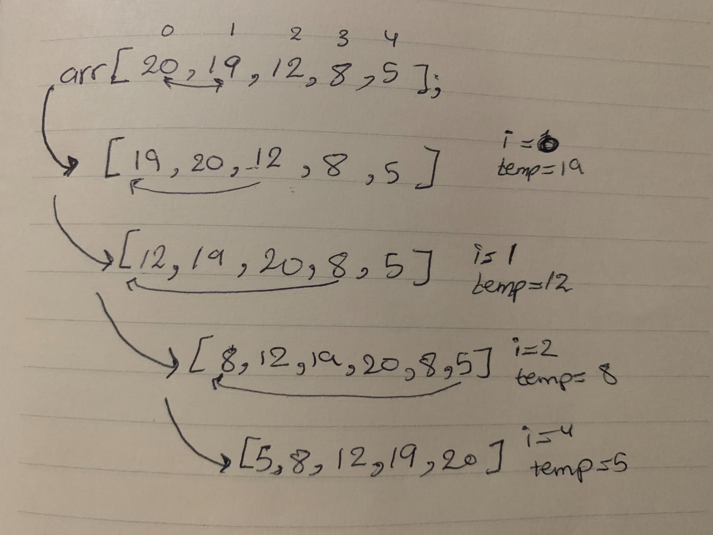

## Challenge Summary
  - Insertion Sort Insertion sort is a simple sorting algorithm that works the way we sort playing cards in our hands.

# Challenge Description
   - Provide a visual step through for each of the sample arrays based on the provided pseudo code
   - Convert the pseudo-code into working code and make a test for it

## Approach & Efficiency
  - create insertionSort() function that take an array as input and sort it using insertion method .

## Big O notation
 - time =>  O(n^2) because I'm using two loops.

# Pseudo-code vs code :
  - InsertionSort(int[] arr) | function InsertionSort(arr)
    - FOR i = 1 to arr.length | for (let i = 1; i < arr.length ; i++)
 
     - int j <-- i - 1 | t j = i-1;
       - int temp <-- arr[i] | let temp = arr[i]

    - WHILE j >= 0 AND temp < arr[j] | while(j >= 0 && temp < arr[j]
        - arr[j + 1] <-- arr[j] | arr[j + 1] = arr[j]
        - j <-- j - 1 | j = j-1;

  
  - arr[j + 1] <-- temp |  arr[j+1] =temp;

# Tracing:
  - first thing we create a for loop starting from one to the length of the array .
  - we set a variable for the previous index and one for the current index .
  - Using a while loop to shift the values depend on the sorting type.
  
 # UML
  - 
