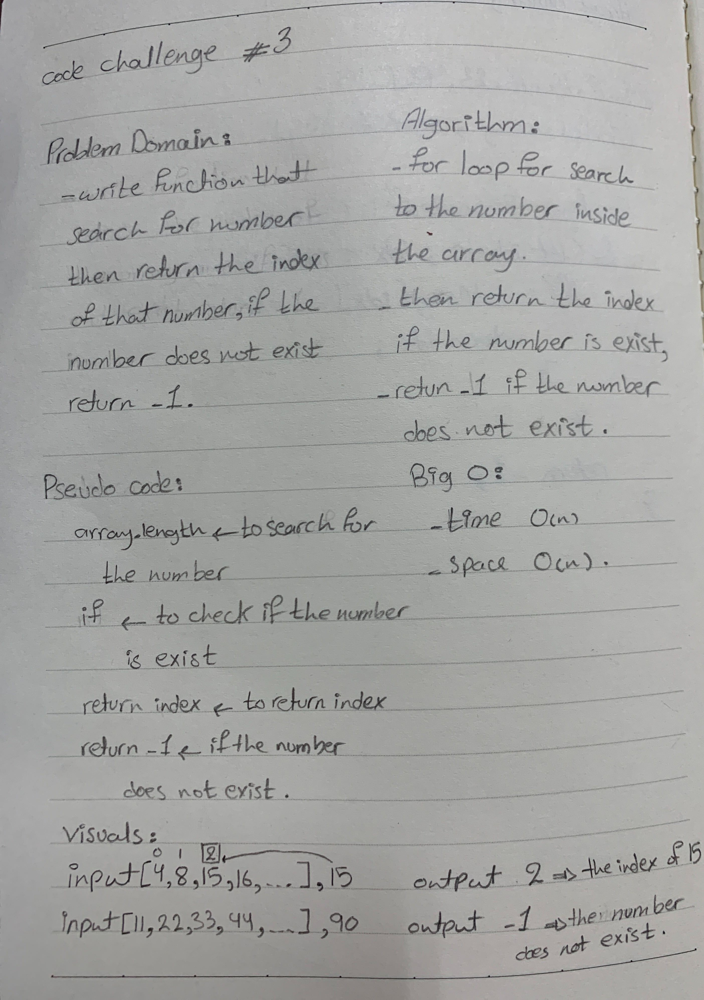

# Binary search Array 
  - third code challenge in 401

# Challenge
  - write function that search for number then return the index of that number , if the number does not exist return -1.  

# Approach & Efficiency
 - first, I did for loop to search if the number is exist return the index of the number.
 - then if the number does not exist return -1.

# Solution
  - 
  