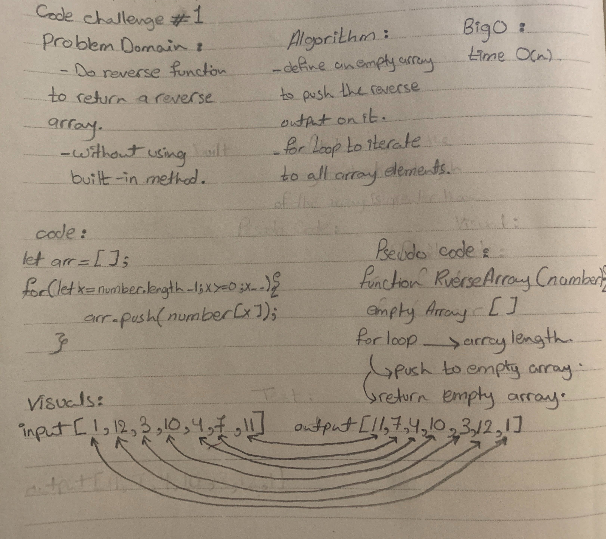

# Reverse an Array
  - first code challenge in 401

## Challenge
  - Reverse an array. 
  - don't use a built-in method.

## Approach & Efficiency
  - I only did for loop inside function and did the for loop reverse and push the output to a new array then console the output.

## Solution
  - 
