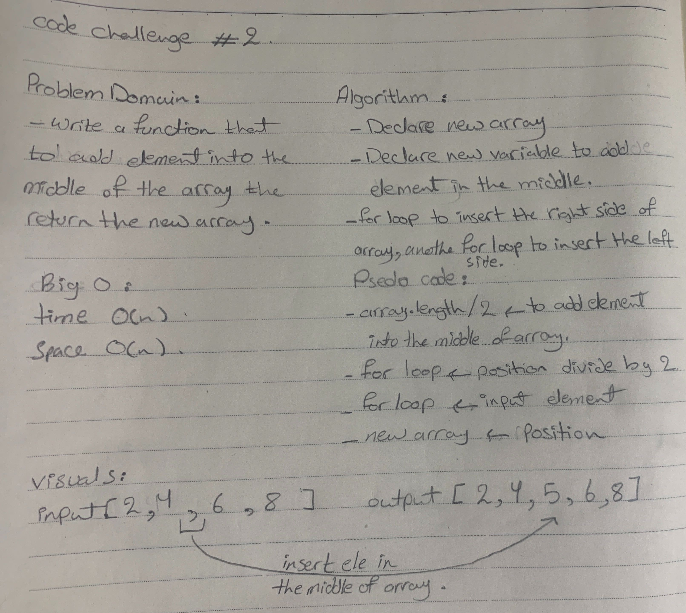

# Shift an array 
  - second code challenge in 401

# Challenge
  - return new array, it add a number in the middle of the array.

# Approach & Efficiency
 - first: I did array of length divid 2 then add the new element.
 - and did to for loop the firt for loop to insert the right side of the array then the second for loop to insert the left side of the array then insert the middle element  of the array.

# Solution
  - 
  
