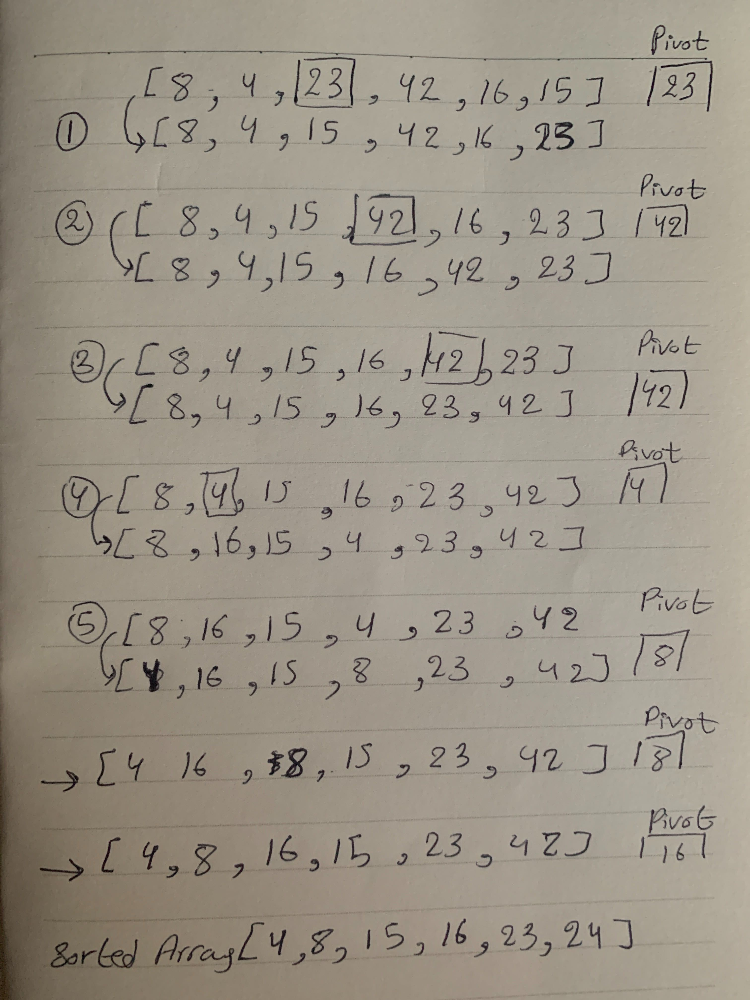

# Algorithms:

- **Quick Sort:**
  ```
   Like the merge sort algorithm, Quick sort is based on the divide-and-conquer approach based on the idea of choosing one element as a pivot element and partitioning the array around it such that: Left side of pivot contains all the elements that are less than the pivot element Right side contains all elements greater than the pivot.
```
   
## pseudo form our instructor:
```
ALGORITHM QuickSort(arr, left, right)
    if left < right
        // Partition the array by setting the position of the pivot value 
        DEFINE position <-- Partition(arr, left, right)
        // Sort the left
        QuickSort(arr, left, position - 1)
        // Sort the right
        QuickSort(arr, position + 1, right)

ALGORITHM Partition(arr, left, right)
    // set a pivot value as a point of reference
    DEFINE pivot <-- arr[right]
    // create a variable to track the largest index of numbers lower than the defined pivot
    DEFINE low <-- left - 1
    for i <- left to right do
        if arr[i] <= pivot
            low++
            Swap(arr, i, low)

     // place the value of the pivot location in the middle.
     // all numbers smaller than the pivot are on the left, larger on the right. 
     Swap(arr, right, low + 1)
    // return the pivot index point
     return low + 1

ALGORITHM Swap(arr, i, low)
    DEFINE temp;
    temp <-- arr[i]
    arr[i] <-- arr[low]
    arr[low] <-- temp
```
## Steps:
```
 - 1. Partition the array by selecting the pivot value (23), and move the pivot to the end of the array.
 - 2. Move the left bound to the right until it reaches a value equal to or greater than the pivot
 - 3. Move the right bound to the left until it crosses the left bound or finds a value less than the pivot. (42)
 - 4. This pattern continous until the right side of the list sorted, then continous to sort the sublist or left side.
```

## Effiency
  - Best case: O(n log(n))
  - Worst case: O(n^2)

## UML
  - 