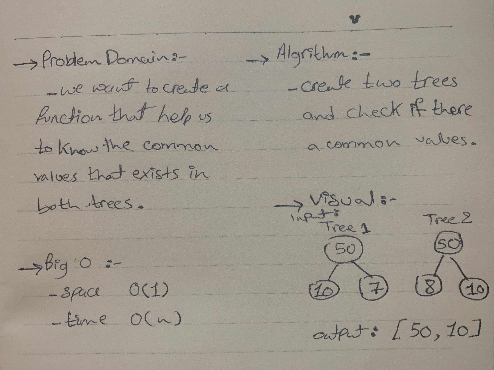

# Tree Intersection
  - return a set of values found in both trees.

# Challenge
  - return a set of values found in both trees without use advance built in methods.

# Approach & Efficiency
  - I used a function that accept a two arrays and return a set of values found in both trees.

# Big O 
  - Time O(n)
  - Space O(1)
  
## API
  - 
